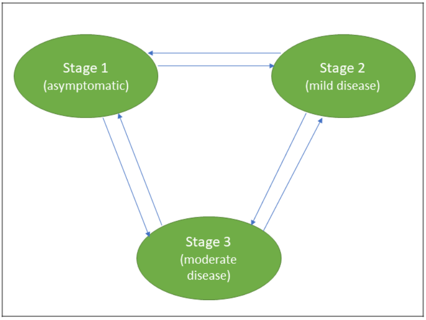

```{r setup, include=FALSE}
knitr::opts_chunk$set(warning = F, message = F,
                      echo = F, dpi = 180,
                      fig.width = 10, fig.height = 6, comment = " ")
```

```{r packages}
library(tidyverse)
library(readxl)
library(SemiMarkov)
library(scales)
library(here)
```

```{r dataset}
HIV_data <- read_excel(here("01Analysis_code", "HIVDataset_SemiMarkov.xlsx"),
                                       sheet = 1) %>% as.data.frame() # read dataset

```

## The situation (what we are modelling)

```{r, out.width="100%",fig.align='left',out.height="80%", echo=F}
library(knitr)

```

Other literature, you will find a different representation of the HIV states, for instance

- Stage 1 - Acute HIV (sym)
- Stage 2 - Chronic HIV
- Stage 3 - AIDS

## Observed transitions and patient characteristics

A total of 552 transitions from 366 HIV patients in the data as shown in the table below.
(more on describing the data and patients)

```{r some_exploratory}
table.state(HIV_data)

```

## Desctiptive statistics

```{r}
# recode HIV data for descriptive stats
hiv_recoded <- HIV_data %>% 
        mutate_at(vars(WHOStaging, DCM, AgeGroup, Sex), as.factor)

hiv_recoded <- hiv_recoded %>% 
        mutate(
        Sex = fct_recode(Sex,
                   "Female" = "1",
                   "Male" = "0"),
        DCM = fct_recode(DCM,
                         "Yes" = "1",
                         "No"="0"),
        WHOStaging = fct_recode(WHOStaging,
                                "Stage 1" = "1",
                                "Stages 2,3,4" = "0"),
        AgeGroup = fct_recode(AgeGroup,
                               "Adult" = "1",
                              "Child" = "0")) %>% 
        distinct(Patientid, .keep_all = T)

# sojourn time
hiv_recoded %>% 
        summarise(
        sojourn_time = paste(round(mean(duration_months, na.rm = T), 1), 
                             "(", round(sd(duration_months, na.rm = T),1), ")", sep = "")
        )

# DCM
hiv_recoded %>% 
        group_by(DCM) %>% 
        summarise(
                total = n()
        ) %>% 
        mutate(
                total = paste(total, "(", percent(total/366), ")", sep = "")
        )

# WHO staging
 hiv_recoded %>% 
        group_by(WHOStaging) %>% 
        summarise(
                total = n()
        )%>% 
        mutate(
                total = paste(total, "(", percent(total/366), ")", sep = "")
        )

# Age group
hiv_recoded %>% 
        group_by(AgeGroup) %>% 
        summarise(
                total = n()
        )%>% 
        mutate(
                total = paste(total, "(", percent(total/366), ")", sep = "")
        )

# Sex
hiv_recoded %>% 
        group_by(Sex) %>% 
        summarise(
                total = n()
        )%>% 
        mutate(
                total = paste(total, "(", percent(total/366), ")", sep = "")
        )

```


## Model parametre definition/initialization
```{r model parametre initialization}
# define states
hiv_states <- c("1", "2", "3")

# assuming weibull distribution ----------------------------------
# transition matrix 1
my_trans1 <- matrix(FALSE, ncol = 3, nrow = 3)

# assign transition time distributions -- assuming weibull
my_trans1[1, 2:3] <- c("W", "W") # '1'-->'2', '1'-->'3'
my_trans1[2, c(1, 3)] <- c("W", "W") # '2'-->'1', '2'-->'3'
my_trans1[3, c(1, 2)] <- c("W", "W") # # '3'-->'1', '3'-->'2'

# assuming exponential distribution ----------------------------------
# transition matrix 2
my_trans2 <- matrix(FALSE, ncol = 3, nrow = 3)

# assign transition time distributions -- assuming weibull
my_trans2[1, 2:3] <- c("E", "E") # '1'-->'2', '1'-->'3'
my_trans2[2, c(1, 3)] <- c("E", "E") # '2'-->'1', '2'-->'3'
my_trans2[3, c(1, 2)] <- c("E", "E") # # '3'-->'1', '3'-->'2'

# assuming exponentiated weibull distribution ----------------------------------
# transition matrix 2
my_trans3 <- matrix(FALSE, ncol = 3, nrow = 3)

# assign transition time distributions -- assuming weibull
my_trans3[1, 2:3] <- c("EW", "EW") # '1'-->'2', '1'-->'3'
my_trans3[2, c(1, 3)] <- c("EW", "EW") # '2'-->'1', '2'-->'3'
my_trans3[3, c(1, 2)] <- c("EW", "EW") # # '3'-->'1', '3'-->'2'

```


```{r fit models and evaluate}
# model without covariates  to evaluate distribution paramtres
# Are the distribution paramtres significantly different from 1? Wald test

# weibull distribution
model_fit_1 <- semiMarkov(data = HIV_data, 
                      states = hiv_states,
                      mtrans = my_trans1)

model_fit_1$table.dist

# exponential distributio
model_fit_2 <- semiMarkov(data = HIV_data, 
                      states = hiv_states,
                      mtrans = my_trans2)

model_fit_2$table.dist # sojourn time distribution between 1 --> 3 cannot be assument Expon.

# Exponentiated weibull
model_fit_3 <- semiMarkov(data = HIV_data, 
                      states = hiv_states,
                      mtrans = my_trans3)

model_fit_3$table.dist
```

We can only assume parametre distribution for mtrans 1 i.e. Weibull distribution from the above output. Furthermore, the exponential distribution assumes constant hazard rate over time, which might not be case in our case.

It is also possible to look closer and tailor a distribution for each transition separately within the transition matrix for optimum results


## Covariates

All our covariates are time fixed, hence we are going to use `model_fit_1` to estimate hazard rates of covariates for both sojourn time and hazard rate due to semi-Markov process.

```{r model with covariates}
# prepare dataframes of covariates
WHOStaging <- as.data.frame(HIV_data$WHOStaging)
DCM <- as.data.frame(HIV_data$DCM)
AgeGroup <- as.data.frame(HIV_data$AgeGroup)
Sex <- as.data.frame(HIV_data$Sex)
# -------------------------------------------------------------------------------------
```

## Univariate modeling

*Estimation of hazard rate of WHOStaging*

```{r}
model_fit_1a <- semiMarkov(data = HIV_data,
                          states = hiv_states,
                          mtrans = my_trans1,
                          cov = WHOStaging)
model_fit_1a$table.coef

# computing  hazard rates
hazard(model_fit_1a, cov = 1) # alpha default

hazard(model_fit_1a, 
       type = "lambda", 
       cov = 1) # lambda (semi-markove process)
```

# Sojourn time hazard rate plot for WHOStaging
```{r}
# sojourn time hazard rate
plot(hazard(model_fit_1a, cov = 1),
     hazard(model_fit_1a, cov = 0),
     transitions = "13")
```


# Semi-Markov process hazard rate plot for WHOStaging
```{r}
# hazard rate due to semi-process
plot(hazard(model_fit_1a, cov = 1, type = "lambda"),
     hazard(model_fit_1a, cov = 0, type = "lambda"),
     transitions = "13")
```


*Estimation of hazard rate of DCM*

```{r}
model_fit_1b <- semiMarkov(data = HIV_data,
                          states = hiv_states,
                          mtrans = my_trans1,
                          cov = DCM)
model_fit_1b$table.coef

# computing  hazard rates
hazard(model_fit_1b, cov = 1) # alpha default

hazard(model_fit_1b, 
       type = "lambda", 
       cov = 1) # lambda (semi-markove process)
```


# Sojourn time hazard rate plot for DCM
```{r}
# sojourn time hazard rate
plot(hazard(model_fit_1b, cov = 1),
     hazard(model_fit_1b, cov = 0),
     transitions = "31")
```


# Semi-Markov process hazard rate plot for DCM
```{r}
# hazard rate due to semi-process
plot(hazard(model_fit_1b, cov = 1, type = "lambda"),
     hazard(model_fit_1b, cov = 0, type = "lambda"),
     transitions = "31")
```


*Estimation of hazard rate of AgeGroup*

```{r}
model_fit_1c <- semiMarkov(data = HIV_data,
                          states = hiv_states,
                          mtrans = my_trans1,
                          cov = AgeGroup)
model_fit_1c$table.coef

# computing  hazard rates
hazard(model_fit_1c, cov = 1) # alpha default

hazard(model_fit_1c, 
       type = "lambda", 
       cov = 1) # lambda (semi-markove process)
```


# Sojourn time hazard rate plot for AgeGroup
```{r}
# sojourn time hazard rate
plot(hazard(model_fit_1c, cov = 1),
     hazard(model_fit_1c, cov = 0),
     transitions = "13")
```


# Semi-Markov process hazard rate plot for AgeGroup
```{r}
# hazard rate due to semi-process
plot(hazard(model_fit_1c, cov = 1, type = "lambda"),
     hazard(model_fit_1c, cov = 0, type = "lambda"),
     transitions = "13")
```


*Estimation of hazard rate of Sex*

```{r}
model_fit_1d <- semiMarkov(data = HIV_data,
                          states = hiv_states,
                          mtrans = my_trans1,
                          cov = Sex)
model_fit_1d$table.coef

# computing  hazard rates
hazard(model_fit_1d, cov = 1) # alpha default

hazard(model_fit_1d, 
       type = "lambda", 
       cov = 1) # lambda (semi-markove process)
```


# Sojourn time hazard rate plot for Sex
```{r}
# sojourn time hazard rate
plot(hazard(model_fit_1d, cov = 1),
     hazard(model_fit_1d, cov = 0),
     transitions = "32")
```


# Semi-Markov process hazard rate plot for Sex
```{r}
# hazard rate due to semi-process
plot(hazard(model_fit_1d, cov = 1, type = "lambda"),
     hazard(model_fit_1d, cov = 0, type = "lambda"),
     transitions = "13")
```


## Multiple covariate modelling

In combining the covariates, we will need to study the univariate and check which covariate affect what transition and specify in `cov_tra` argument. (Not a final model for now)


```{r}
model_fit_1e <- semiMarkov(data = HIV_data,
                          states = hiv_states,
                          mtrans = my_trans1,
                          cov = data.frame(WHOStaging, DCM, AgeGroup, Sex))
model_fit_1e$table.coef

# computing  hazard rates
hazard(model_fit_1e) # alpha default

hazard(model_fit_1e, 
       type = "lambda") # lambda (semi-markove process)
```


