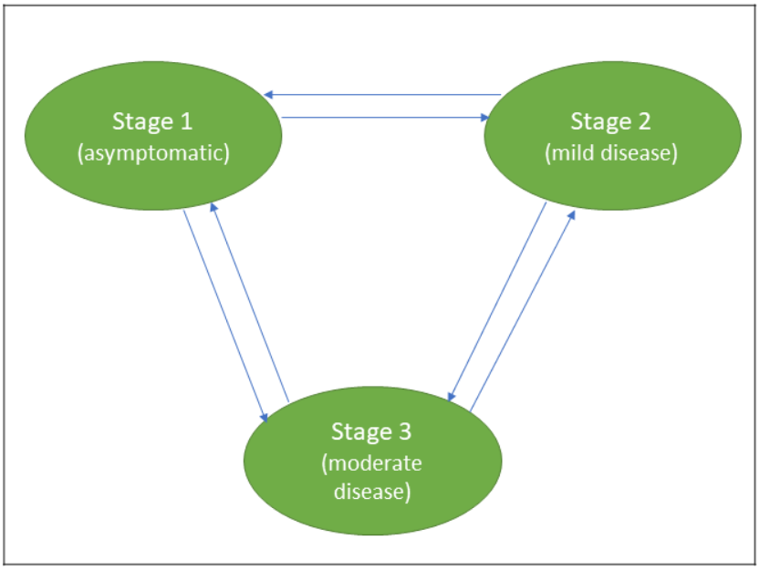
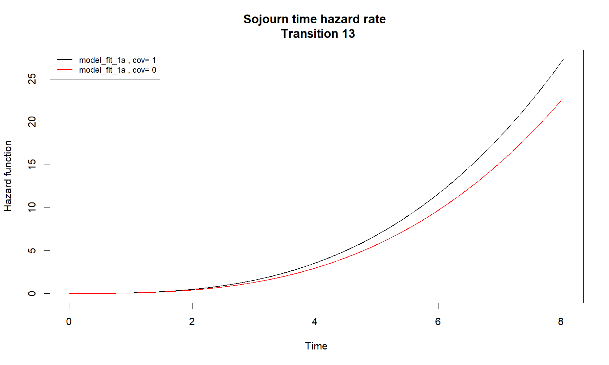
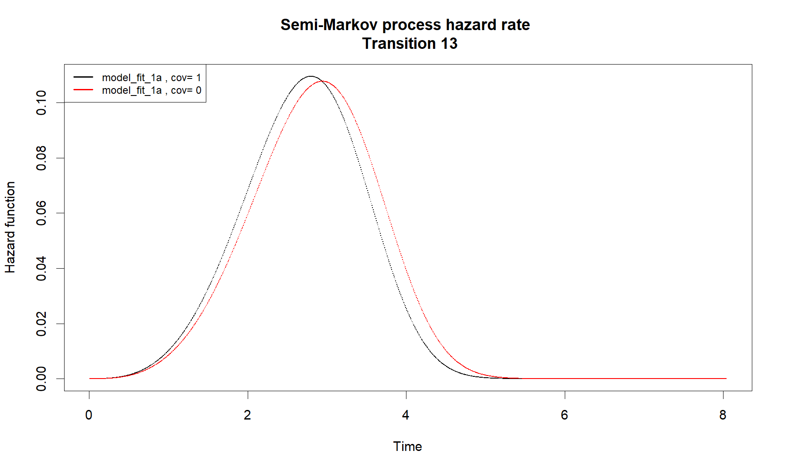
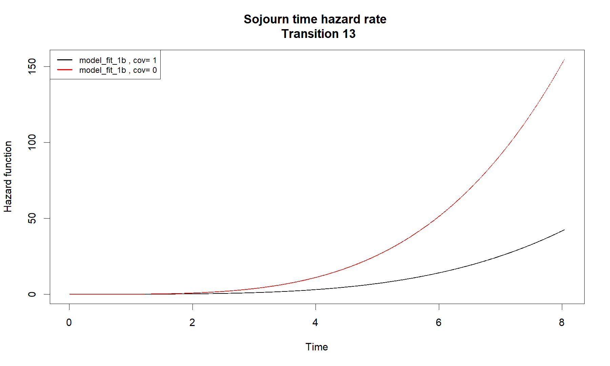
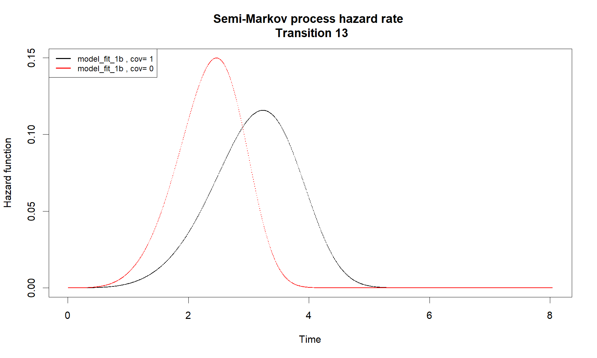
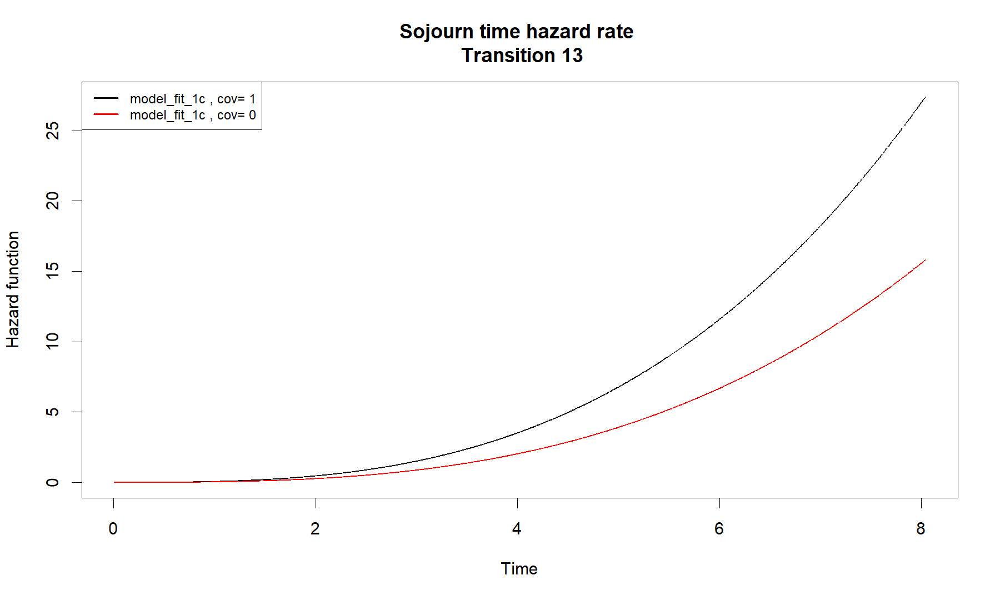
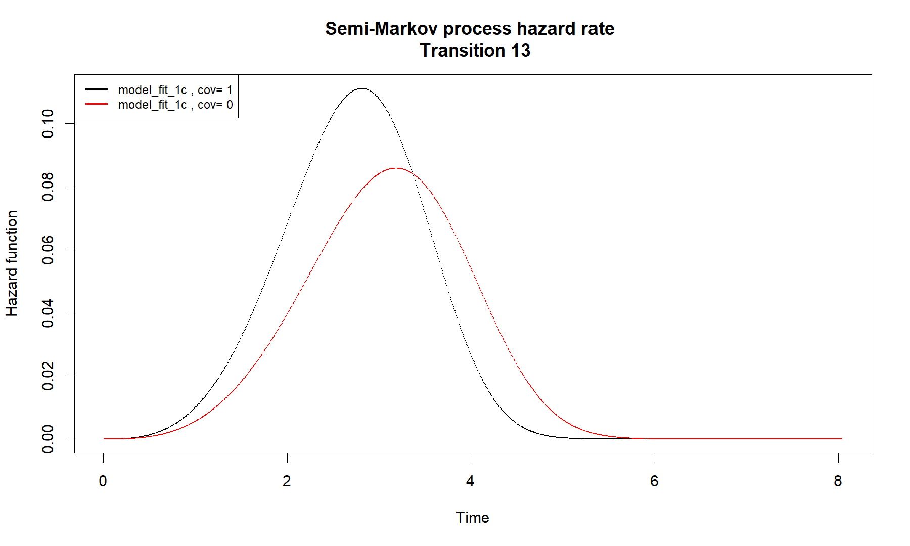
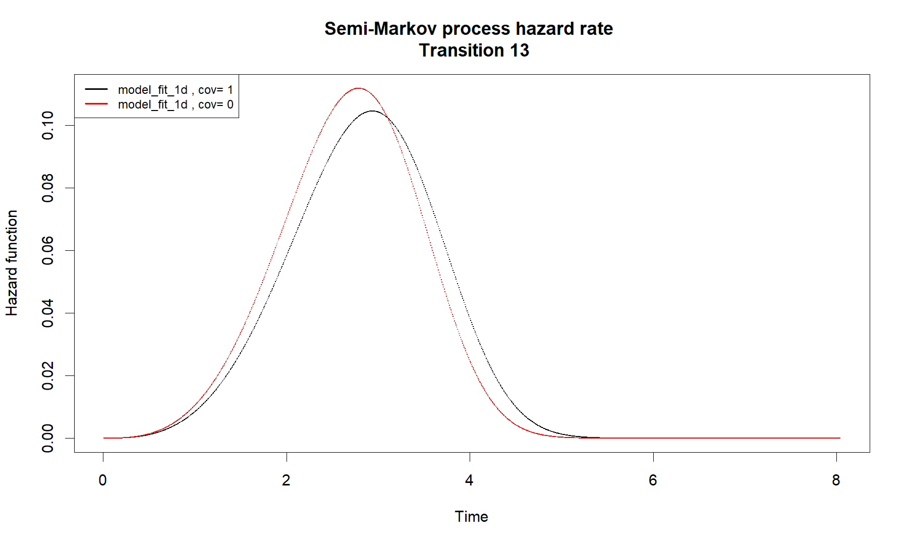

Semi Markov Analysis - Group 1
================
27 March, 2020

## The situation (what we are modelling)



Other literature, you will find a different representation of the HIV
states, for instance

  - Stage 1 - Acute HIV
  - Stage 2 - Chronic HIV
  - Stage 3 - AIDS

## Observed transitions and patient characteristics

A total of 552 transitions from 366 HIV patients in the data as shown in
the table below. (more on describing the data and patients)

``` 
  $table.state
      1   2   3
  1 151  94  43
  2 112 115  70
  3 114 119 100
  
  $Ncens
  [1] 366
```

## Model parametre definition/initialization

``` 
  
  Iter: 1 fn: 1615.2486  Pars:  9.36243 2.94492 6.63966 3.06917 2.43166 5.72270 1.35845 3.90000 1.41184 3.58816 7.68670 1.61996 0.83719 0.73928 0.34749
  Iter: 2 fn: 1615.2486  Pars:  9.36258 2.94492 6.63965 3.06917 2.43166 5.72268 1.35843 3.90001 1.41184 3.58815 7.68668 1.61996 0.83719 0.73928 0.34749
  solnp--> Completed in 2 iterations
```

``` 
  $Sigma
    Type Index Transition Sigma   SD Lower_CI Upper_CI Wald_H0 Wald_test p_value
  1 dist     1     1 -> 2 9.363 0.84     7.72    11.01    1.00     99.16 <0.0001
  2 dist     2     1 -> 3 2.945 0.13     2.70     3.19    1.00    236.13 <0.0001
  3 dist     3     2 -> 1  6.64 0.47     5.72     7.56    1.00    143.66 <0.0001
  4 dist     4     2 -> 3 3.069 0.11     2.85     3.29    1.00    335.01 <0.0001
  5 dist     5     3 -> 1 2.432 0.03     2.37     2.49    1.00   2049.64 <0.0001
  6 dist     6     3 -> 2 5.723 0.34     5.06     6.38    1.00    197.66 <0.0001
  
  $Nu
    Type Index Transition    Nu   SD Lower_CI Upper_CI Wald_H0 Wald_test p_value
  1 dist     7     1 -> 2 1.358 0.12     1.12     1.59    1.00      8.91  0.0028
  2 dist     8     1 -> 3   3.9 0.41     3.09     4.71    1.00     49.17 <0.0001
  3 dist     9     2 -> 1 1.412 0.11     1.20     1.63    1.00     14.09  0.0002
  4 dist    10     2 -> 3 3.588 0.29     3.02     4.16    1.00     79.49 <0.0001
  5 dist    11     3 -> 1 7.687 0.44     6.83     8.55    1.00    233.01 <0.0001
  6 dist    12     3 -> 2  1.62 0.12     1.38     1.86    1.00     26.33 <0.0001
```

``` 
  
  Iter: 1 fn: 1894.9202  Pars:  9.66638 6.90269 5.00360 7.24220 3.99801 5.19016 0.73265 0.56477 0.45916
  Iter: 2 fn: 1894.9202  Pars:  9.66675 6.90192 5.00366 7.24206 3.99801 5.19017 0.73267 0.56478 0.45916
  solnp--> Completed in 2 iterations
```

``` 
  $Sigma
    Type Index Transition Estimation   SD Lower_CI Upper_CI Wald_H0 Wald_test
  1 dist     1     1 -> 2      9.667 2.16     5.43    13.91    1.00     16.04
  2 dist     2     1 -> 3      6.902 4.33    -1.58    15.38    1.00      1.86
  3 dist     3     2 -> 1      5.004 1.09     2.88     7.13    1.00     13.60
  4 dist     4     2 -> 3      7.242 1.79     3.74    10.74    1.00     12.20
  5 dist     5     3 -> 1      3.998 0.66     2.70     5.29    1.00     20.57
  6 dist     6     3 -> 2       5.19 0.71     3.81     6.57    1.00     35.21
    p_value
  1  0.0001
  2  0.1726
  3  0.0002
  4  0.0005
  5 <0.0001
  6 <0.0001
```

``` 
  
  Iter: 1 fn: 1422.7852  Pars:     0.001000    0.346838    0.001163    0.252479    0.884566    0.001862    0.203835    0.959422    0.229578    0.835604    2.085512    0.253494  272.830439  596.862229  530.652773  807.162884  999.999241  764.772300    0.839091    0.742389    0.346547
  Iter: 2 fn: 1422.7851  Pars:     0.001000    0.346838    0.001163    0.252479    0.884566    0.001862    0.203835    0.959422    0.229578    0.835604    2.085511    0.253494  272.830771  596.862829  530.653458  807.163023  999.999241  764.772776    0.839091    0.742389    0.346548
  solnp--> Completed in 2 iterations
```

``` 
  $Sigma
    Type Index Transition Sigma   SD Lower_CI Upper_CI Wald_H0 Wald_test p_value
  1 dist     1     1 -> 2 0.001 0.00     0.00     0.00    1.00       Inf <0.0001
  2 dist     2     1 -> 3 0.347 0.08     0.19     0.50    1.00     65.84 <0.0001
  3 dist     3     2 -> 1 0.001 0.00     0.00     0.00    1.00       Inf <0.0001
  4 dist     4     2 -> 3 0.252 0.05     0.15     0.36    1.00    190.71 <0.0001
  5 dist     5     3 -> 1 0.885 0.06     0.77     1.00    1.00      4.05  0.0442
  6 dist     6     3 -> 2 0.002 0.00     0.00     0.00    1.00       Inf <0.0001
  
  $Nu
    Type Index Transition    Nu   SD Lower_CI Upper_CI Wald_H0 Wald_test p_value
  1 dist     7     1 -> 2 0.204 0.02     0.17     0.24    1.00   1920.84 <0.0001
  2 dist     8     1 -> 3 0.959 0.12     0.73     1.19    1.00      0.12  0.7290
  3 dist     9     2 -> 1  0.23 0.02     0.20     0.26    1.00   1914.68 <0.0001
  4 dist    10     2 -> 3 0.836 0.08     0.68     0.99    1.00      4.30  0.0381
  5 dist    11     3 -> 1 2.086 0.15     1.80     2.37    1.00     55.50 <0.0001
  6 dist    12     3 -> 2 0.253 0.02     0.22     0.29    1.00   1547.98 <0.0001
  
  $Theta
    Type Index Transition   Theta   SD Lower_CI Upper_CI Wald_H0 Wald_test
  1 dist    13     1 -> 2 272.831 0.00   272.83   272.83    1.00       Inf
  2 dist    14     1 -> 3 596.863 0.00   596.86   596.86    1.00       Inf
  3 dist    15     2 -> 1 530.653 0.00   530.65   530.65    1.00       Inf
  4 dist    16     2 -> 3 807.163 0.00   807.16   807.16    1.00       Inf
  5 dist    17     3 -> 1 999.999 0.00  1000.00  1000.00    1.00       Inf
  6 dist    18     3 -> 2 764.773 0.00   764.77   764.77    1.00       Inf
    p_value
  1 <0.0001
  2 <0.0001
  3 <0.0001
  4 <0.0001
  5 <0.0001
  6 <0.0001
```

We can only assume parametre distribution for mtrans 1 i.e. Weibull
distribution from the above output. Furthermore, the exponential
distribution assumes constant hazard rate over time, which might not be
case in our case.

It is also possible to look closer and tailor a distribution for each
transition separately within the transition matrix for optimum results

## Covariates

All our covariates are time fixed, hence we are going to use
`model_fit_1` to estimate hazard rates of covariates for both sojourn
time and hazard rate due to semi-Markov process.

## Univariate modeling

*Estimation of hazard rate of WHOStaging*

``` 
  
  Iter: 1 fn: 1570.7514  Pars:   8.84188  3.02581  2.61425  6.03014  2.43860  6.45699  1.35784  3.93035  3.65024  1.44291  7.68122  1.63698  0.83778  0.40671  0.34757 -0.09380  0.18117 -0.23733 -0.82106  0.03216  0.35253
  Iter: 2 fn: 1570.7514  Pars:   8.84180  3.02581  2.61425  6.03012  2.43860  6.45699  1.35784  3.93032  3.65024  1.44291  7.68126  1.63699  0.83778  0.40671  0.34757 -0.09382  0.18116 -0.23732 -0.82106  0.03216  0.35253
  solnp--> Completed in 2 iterations
```

``` 
    Type Index Transition Covariates  Estimation   SD Lower_CI Upper_CI Wald_H0
  1 coef     1     1 -> 2      Beta1 -0.09381620 0.27    -0.63     0.44    0.00
  2 coef     2     1 -> 3      Beta1  0.18115586 0.33    -0.47     0.83    0.00
  3 coef     3     2 -> 1      Beta1 -0.23732091 0.28    -0.80     0.32    0.00
  4 coef     4     2 -> 3      Beta1 -0.82105857 0.24    -1.29    -0.35    0.00
  5 coef     5     3 -> 1      Beta1  0.03215509 0.21    -0.37     0.43    0.00
  6 coef     6     3 -> 2      Beta1  0.35252742 0.19    -0.02     0.72    0.00
    Wald_test p_value
  1      0.12  0.7290
  2      0.30  0.5839
  3      0.70  0.4028
  4     11.65  0.0006
  5      0.02  0.8875
  6      3.49  0.0617
```

``` 
  model_fit_1a  : Hazard rates of waiting times
  
  Transition_matrix
    1         2         3        
  1 "-"       "Weibull" "Weibull"
  2 "Weibull" "-"       "Weibull"
  3 "Weibull" "Weibull" "-"      
  
  Hazard rates values 
            12           13           21          23           31         32
  1 0.01140972 4.415293e-08 2.422551e-07 0.005609586 8.514372e-17 0.00509113
  2 0.01462161 3.365698e-07 1.520804e-06 0.007625362 8.737985e-15 0.00791710
  3 0.01690470 1.104281e-06 4.454064e-06 0.009125429 1.311965e-13 0.01025024
  4 0.01873766 2.565611e-06 9.547144e-06 0.010365496 8.967470e-13 0.01231170
  5 0.02029520 4.933654e-06 1.724677e-05 0.011442282 3.982452e-12 0.01419216
  6 0.02166345 8.417739e-06 2.796126e-05 0.012404605 1.346421e-11 0.01593991
  
       Time
  1 0.00804
  2 0.01608
  3 0.02412
  4 0.03216
  5 0.04020
  6 0.04824
  
    cova
  1    1
  2    1
  3    1
  4    1
  5    1
  6    1
  
  Summary statistics
                  12           13           21          23           31
  Min.    0.01140972 4.415293e-08 2.422551e-07 0.005609586 8.514372e-17
  1st Qu. 0.08237883 4.737165e-01 5.531317e-01 0.064801047 9.122660e-01
  Median  0.10549348 3.589977e+00 3.454058e+00 0.088009150 9.237877e+01
  Mean    0.09959187 6.955986e+00 5.935399e+00 0.082933896 1.230713e+03
  3rd Qu. 0.12193668 1.175567e+01 1.009823e+01 0.105291316 1.380844e+03
  Max.    0.13514204 2.728564e+01 2.162612e+01 0.119581849 9.417214e+03
                  32
  Min.    0.00509113
  1st Qu. 0.17182949
  Median  0.26686869
  Mean    0.25356076
  3rd Qu. 0.34536719
  Max.    0.41473737
```

``` 
  [1] "1 1 0 1 6 6 7.16265058538368e-09 0.999943402590078"
  [1] "2 2 0 1 6 6 0.00332798845823161 0.999981455717204"
  [1] "3 3 0 1 6 6 0.00332153830189253 0.999983686179198"
```

``` 
  model_fit_1a  : Hazard rates of the semi-Markov process
  
  Transition_matrix
    1         2         3        
  1 "-"       "Weibull" "Weibull"
  2 "Weibull" "-"       "Weibull"
  3 "Weibull" "Weibull" "-"      
  
  Hazard rates values 
             12           13           21          23           31          32
  1 0.009558691 7.163056e-09 9.853020e-08 0.003328050 2.959362e-17 0.003321592
  2 0.012249295 5.460752e-08 6.185624e-07 0.004523869 3.037188e-15 0.005165239
  3 0.014161666 1.791857e-07 1.811691e-06 0.005413659 4.560405e-14 0.006687242
  4 0.015696836 4.163577e-07 3.883483e-06 0.006149133 3.117288e-13 0.008031887
  5 0.017001184 8.007585e-07 7.015818e-06 0.006787674 1.384483e-12 0.009258313
  6 0.018146855 1.366437e-06 1.137501e-05 0.007358246 4.681147e-12 0.010398027
  
       Time
  1 0.00804
  2 0.01608
  3 0.02412
  4 0.03216
  5 0.04020
  6 0.04824
  
    cova
  1    1
  2    1
  3    1
  4    1
  5    1
  6    1
  
  Summary statistics
                   12           13           21         23            31
  Min.    0.009558691 6.756099e-24 5.934125e-20 0.00332805 1.725771e-320
  1st Qu. 0.070311728 5.227794e-08 5.636767e-07 0.04172830 3.633853e-320
  Median  0.104790662 2.474467e-03 8.752045e-03 0.08632987  9.711059e-20
  Mean    0.095496476 2.611133e-02 7.272784e-02 0.07514161  6.648766e-02
  3rd Qu. 0.121936676 4.711874e-02 1.343554e-01 0.10529131  7.871063e-03
  Max.    0.135142038 1.095453e-01 2.952731e-01 0.11958185  6.602145e-01
                   32
  Min.    0.003321592
  1st Qu. 0.113186745
  Median  0.266868691
  Mean    0.240188655
  3rd Qu. 0.345367194
  Max.    0.414737370
```

# Sojourn time hazard rate plot for WHOStaging

<!-- -->

# Semi-Markov process hazard rate plot for WHOStaging

``` 
  [1] "1 1 0 1 6 6 7.16265058538368e-09 0.999943402590078"
  [1] "2 2 0 1 6 6 0.00332798845823161 0.999981455717204"
  [1] "3 3 0 1 6 6 0.00332153830189253 0.999983686179198"
  [1] "1 1 0 1 6 6 5.97583741651534e-09 0.999937836000994"
  [1] "2 2 0 1 6 6 0.00756389933358081 0.999957851670866"
  [1] "3 3 0 1 6 6 0.00233475749879611 0.999988532821086"
```

<!-- -->

*Estimation of hazard rate of DCM*

``` 
  
  Iter: 1 fn: 1715.2221  Pars:   8.71362  2.51413  6.79600  2.98071  2.33683  5.23252  1.35909  4.78302  1.41417  3.63128  2.90509  2.02684  0.83860  0.73864  0.48210 -0.29699 -1.29338  0.08715 -0.24765 -2.82641  0.99435
  Iter: 2 fn: 1715.2221  Pars:   8.71356  2.51412  6.79611  2.98069  2.33681  5.23251  1.35911  4.78311  1.41416  3.63130  2.90516  2.02683  0.83860  0.73864  0.48210 -0.29700 -1.29343  0.08715 -0.24768 -2.82645  0.99426
  solnp--> Completed in 2 iterations
```

``` 
    Type Index Transition Covariates  Estimation   SD Lower_CI Upper_CI Wald_H0
  1 coef     1     1 -> 2      Beta1 -0.29700347 0.23    -0.74     0.15    0.00
  2 coef     2     1 -> 3      Beta1 -1.29342573 0.39    -2.06    -0.52    0.00
  3 coef     3     2 -> 1      Beta1  0.08715437 0.19    -0.29     0.47    0.00
  4 coef     4     2 -> 3      Beta1 -0.24768095 0.26    -0.76     0.26    0.00
  5 coef     5     3 -> 1      Beta1 -2.82644619 0.32    -3.45    -2.20    0.00
  6 coef     6     3 -> 2      Beta1  0.99425582 0.29     0.43     1.56    0.00
    Wald_test p_value
  1      1.73  0.1884
  2     10.80  0.0010
  3      0.20  0.6547
  4      0.90  0.3428
  5     77.99 <0.0001
  6     12.04  0.0005
```

``` 
  model_fit_1b  : Hazard rates of waiting times
  
  Transition_matrix
    1         2         3        
  1 "-"       "Weibull" "Weibull"
  2 "Weibull" "-"       "Weibull"
  3 "Weibull" "Weibull" "-"      
  
  Hazard rates values 
             12           13         21           23           31          32
  1 0.009423116 1.897786e-10 0.01392639 1.652741e-07 1.492567e-06 0.001351977
  2 0.012086414 2.612619e-09 0.01855724 1.024013e-06 5.590403e-06 0.002754710
  3 0.013980852 1.211291e-08 0.02195045 2.976150e-06 1.210388e-05 0.004177261
  4 0.015502452 3.596708e-08 0.02472795 6.344629e-06 2.093883e-05 0.005612836
  5 0.016795842 8.366161e-08 0.02712217 1.141315e-05 3.203179e-05 0.007058176
  6 0.017932324 1.667545e-07 0.02924949 1.843977e-05 4.533503e-05 0.008511343
  
       Time
  1 0.00804
  2 0.01608
  3 0.02412
  4 0.03216
  5 0.04020
  6 0.04824
  
    cova
  1    1
  2    1
  3    1
  4    1
  5    1
  6    1
  
  Summary statistics
                   12           13         21           23           31
  Min.    0.009423116 1.897786e-10 0.01392639 1.652741e-07 1.492567e-06
  1st Qu. 0.068515090 2.263820e-01 0.13724924 3.398865e-01 5.557317e-02
  Median  0.087816874 3.093050e+00 0.18273674 2.094844e+00 2.073587e-01
  Mean    0.082899586 8.889951e+00 0.17223472 3.571372e+00 2.672178e-01
  3rd Qu. 0.101557094 1.430418e+01 0.21609075 6.077696e+00 4.483863e-01
  Max.    0.112596548 4.242008e+01 0.24340023 1.294522e+01 7.751832e-01
                   32
  Min.    0.001351977
  1st Qu. 0.393170614
  Median  0.799461300
  Mean    0.803675826
  3rd Qu. 1.211479485
  Max.    1.627264818
```

``` 
  [1] "1 1 0 1 6 6 3.06294915976853e-11 0.999953254397904"
  [1] "2 2 0 1 6 6 4.31957745364934e-08 0.999941519236846"
  [1] "3 3 0 1 6 6 0.000700189376230884 0.999997220499549"
```

``` 
  model_fit_1b  : Hazard rates of the semi-Markov process
  
  Transition_matrix
    1         2         3        
  1 "-"       "Weibull" "Weibull"
  2 "Weibull" "-"       "Weibull"
  3 "Weibull" "Weibull" "-"      
  
  Hazard rates values 
             12           13         21           23           31           32
  1 0.007902192 3.063092e-11 0.01028640 4.319830e-08 7.195638e-07 0.0007001913
  2 0.010135482 4.217168e-10 0.01370639 2.676761e-07 2.695146e-06 0.0014266577
  3 0.011723929 1.955381e-09 0.01621193 7.780566e-07 5.835393e-06 0.0021633645
  4 0.012999649 5.806727e-09 0.01826241 1.658911e-06 1.009501e-05 0.0029067808
  5 0.014083931 1.350827e-08 0.02002953 2.984622e-06 1.544354e-05 0.0036552050
  6 0.015036574 2.692786e-08 0.02159926 4.822939e-06 2.185816e-05 0.0044076221
  
       Time
  1 0.00804
  2 0.01608
  3 0.02412
  4 0.03216
  5 0.04020
  6 0.04824
  
    cova
  1    1
  2    1
  3    1
  4    1
  5    1
  6    1
  
  Summary statistics
                   12           13        21           23           31
  Min.    0.007902192 1.713964e-30 0.0102864 6.519979e-12 7.195638e-07
  1st Qu. 0.057399297 3.256393e-08 0.1011932 9.883816e-05 3.166338e-02
  Median  0.086221784 1.863885e-03 0.1726526 1.486013e-02 1.603990e-01
  Mean    0.078856747 2.593586e-02 0.1583657 5.154933e-02 2.401082e-01
  3rd Qu. 0.101557094 4.400595e-02 0.2160828 1.005887e-01 4.174671e-01
  Max.    0.112596548 1.157206e-01 0.2434002 1.811436e-01 7.641521e-01
                    32
  Min.    0.0007001913
  1st Qu. 0.0588202664
  Median  0.1192760775
  Mean    0.1160804979
  3rd Qu. 0.1758142616
  Max.    0.1990027585
```

# Sojourn time hazard rate plot for DCM

<!-- -->

# Semi-Markov process hazard rate plot for DCM

``` 
  [1] "1 1 0 1 6 6 3.06294915976853e-11 0.999953254397904"
  [1] "2 2 0 1 6 6 4.31957745364934e-08 0.999941519236846"
  [1] "3 3 0 1 6 6 0.000700189376230884 0.999997220499549"
  [1] "1 1 0 1 6 6 1.11652240850647e-10 0.999937089441428"
  [1] "2 2 0 1 6 6 5.53359967007423e-08 0.99994640008663"
  [1] "3 3 0 1 6 6 0.000259070025201488 0.999998938698382"
```

<!-- -->

*Estimation of hazard rate of AgeGroup*

``` 
  
  Iter: 1 fn: 1675.4531  Pars:  21.93889  3.33343  2.35866  4.24381  3.67552  2.47044  1.36230  3.94322  3.65736  1.46085  1.51916  3.16851  0.83734  0.40679  0.62510  1.21100  0.55001 -0.60073 -1.09513 -0.72143 -0.56573
  Iter: 2 fn: 1675.4531  Pars:  21.94063  3.33337  2.35855  4.24363  3.67516  2.47044  1.36230  3.94319  3.65737  1.46085  1.51917  3.16855  0.83734  0.40679  0.62510  1.21111  0.54994 -0.60089 -1.09518 -0.72155 -0.56574
  solnp--> Completed in 2 iterations
```

``` 
    Type Index Transition Covariates Estimation   SD Lower_CI Upper_CI Wald_H0
  1 coef     1     1 -> 2      Beta1  1.2111096 0.72    -0.19     2.61    0.00
  2 coef     2     1 -> 3      Beta1  0.5499446 0.56    -0.54     1.64    0.00
  3 coef     3     2 -> 1      Beta1 -0.6008895 0.57    -1.72     0.51    0.00
  4 coef     4     2 -> 3      Beta1 -1.0951821 0.44    -1.95    -0.24    0.00
  5 coef     5     3 -> 1      Beta1 -0.7215469 0.29    -1.29    -0.16    0.00
  6 coef     6     3 -> 2      Beta1 -0.5657355 0.40    -1.34     0.21    0.00
    Wald_test p_value
  1      2.87  0.0902
  2      0.98  0.3222
  3      1.11  0.2921
  4      6.31  0.0120
  5      6.29  0.0121
  6      2.05  0.1522
```

``` 
  model_fit_1c  : Hazard rates of waiting times
  
  Transition_matrix
    1         2         3        
  1 "-"       "Weibull" "Weibull"
  2 "Weibull" "-"       "Weibull"
  3 "Weibull" "Weibull" "-"      
  
  Hazard rates values 
            12           13           21          23          31           32
  1 0.01186160 4.051535e-08 2.359397e-07 0.006405906 0.008355284 2.938204e-06
  2 0.01524777 3.116082e-07 1.488498e-06 0.008816786 0.011974218 1.320933e-05
  3 0.01766054 1.027731e-06 4.372074e-06 0.010628256 0.014779801 3.182318e-05
  4 0.01960059 2.396614e-06 9.390650e-06 0.012135007 0.017160626 5.938538e-05
  5 0.02125102 4.621925e-06 1.699109e-05 0.013449342 0.019268413 9.634602e-05
  6 0.02270215 7.904393e-06 2.758258e-05 0.014628229 0.021181394 1.430679e-04
  
       Time
  1 0.00804
  2 0.01608
  3 0.02412
  4 0.03216
  5 0.04020
  6 0.04824
  
    cova
  1    1
  2    1
  3    1
  4    1
  5    1
  6    1
  
  Summary statistics
                  12           13           21          23          31
  Min.    0.01186160 4.051535e-08 2.359397e-07 0.006405906 0.008355284
  1st Qu. 0.08777821 4.667143e-01 5.603619e-01 0.081709247 0.147087812
  Median  0.11275499 3.568507e+00 3.516499e+00 0.112357373 0.210577861
  Mean    0.10642703 6.953521e+00 6.060781e+00 0.105885604 0.198697726
  3rd Qu. 0.13056559 1.174639e+01 1.031051e+01 0.135400409 0.259826807
  Max.    0.14489105 2.736509e+01 2.212602e+01 0.154572183 0.301629187
                    32
  Min.    2.938204e-06
  1st Qu. 4.687693e-01
  Median  2.098346e+00
  Mean    2.975507e+00
  3rd Qu. 5.047915e+00
  Max.    9.413127e+00
```

``` 
  [1] "1 1 0 1 6 6 6.5900834836288e-09 0.999941384117435"
  [1] "2 2 0 1 6 6 0.0037999384636388 0.999979085911323"
  [1] "3 3 0 1 6 6 1.10153799402031e-06 0.999972356489069"
```

``` 
  model_fit_1c  : Hazard rates of the semi-Markov process
  
  Transition_matrix
    1         2         3        
  1 "-"       "Weibull" "Weibull"
  2 "Weibull" "-"       "Weibull"
  3 "Weibull" "Weibull" "-"      
  
  Hazard rates values 
             12           13           21          23          31           32
  1 0.009932121 6.590470e-09 9.597899e-08 0.003800018 0.005222786 1.101568e-06
  2 0.012767246 5.069272e-08 6.055352e-07 0.005230034 0.007484706 4.952593e-06
  3 0.014787188 1.672108e-07 1.778684e-06 0.006304379 0.009238014 1.193232e-05
  4 0.016411196 3.899757e-07 3.820591e-06 0.007197873 0.010725617 2.226873e-05
  5 0.017792586 7.521807e-07 6.913254e-06 0.007977137 0.012042353 3.613179e-05
  6 0.019007014 1.286566e-06 1.122342e-05 0.008675965 0.013237123 5.365891e-05
  
       Time
  1 0.00804
  2 0.01608
  3 0.02412
  4 0.03216
  5 0.04020
  6 0.04824
  
    cova
  1    1
  2    1
  3    1
  4    1
  5    1
  6    1
  
  Summary statistics
                   12           13           21          23          31
  Min.    0.009932121 7.327122e-24 2.670350e-20 0.003800018 0.005222786
  1st Qu. 0.074753107 5.363924e-08 4.713045e-07 0.052256820 0.095448814
  Median  0.111959637 2.532403e-03 8.741631e-03 0.110207016 0.196265137
  Mean    0.102008568 2.649868e-02 7.482769e-02 0.096008767 0.179223237
  3rd Qu. 0.130565591 4.786671e-02 1.377676e-01 0.135400402 0.259797482
  Max.    0.144891047 1.111590e-01 3.052998e-01 0.154572183 0.301629187
                    32
  Min.    1.179667e-09
  1st Qu. 3.432316e-04
  Median  2.888902e-02
  Mean    7.791375e-02
  3rd Qu. 1.545107e-01
  Max.    2.559254e-01
```

# Sojourn time hazard rate plot for AgeGroup

<!-- -->

# Semi-Markov process hazard rate plot for AgeGroup

``` 
  [1] "1 1 0 1 6 6 6.5900834836288e-09 0.999941384117435"
  [1] "2 2 0 1 6 6 0.0037999384636388 0.999979085911323"
  [1] "3 3 0 1 6 6 1.10153799402031e-06 0.999972356489069"
  [1] "1 1 0 1 6 6 3.80235823826545e-09 0.999982539854202"
  [1] "2 2 0 1 6 6 0.0113599816666177 0.999937475023631"
  [1] "3 3 0 1 6 6 1.93952456710667e-06 0.999943122492991"
```

<!-- -->

*Estimation of hazard rate of Sex*

``` 
  
  Iter: 1 fn: 1606.7964  Pars:   8.95237  2.87300  6.96601  3.26589  2.37461  5.19412  1.36046  3.92586  1.41383  3.79177  8.05699  1.64185  0.83723  0.73938  0.34774 -0.14566 -0.21282  0.15657  0.63747 -0.49816 -0.36575
  Iter: 2 fn: 1606.7964  Pars:   8.95231  2.87300  6.96594  3.26589  2.37461  5.19408  1.36046  3.92592  1.41384  3.79178  8.05698  1.64185  0.83723  0.73938  0.34774 -0.14567 -0.21281  0.15655  0.63743 -0.49815 -0.36575
  solnp--> Completed in 2 iterations
```

``` 
    Type Index Transition Covariates Estimation   SD Lower_CI Upper_CI Wald_H0
  1 coef     1     1 -> 2      Beta1 -0.1456678 0.21    -0.56     0.27    0.00
  2 coef     2     1 -> 3      Beta1 -0.2128112 0.32    -0.85     0.42    0.00
  3 coef     3     2 -> 1      Beta1  0.1565528 0.19    -0.22     0.53    0.00
  4 coef     4     2 -> 3      Beta1  0.6374350 0.27     0.11     1.17    0.00
  5 coef     5     3 -> 1      Beta1 -0.4981473 0.20    -0.90    -0.10    0.00
  6 coef     6     3 -> 2      Beta1 -0.3657513 0.19    -0.74     0.01    0.00
    Wald_test p_value
  1      0.48  0.4884
  2      0.43  0.5120
  3      0.68  0.4096
  4      5.60  0.0180
  5      5.92  0.0150
  6      3.71  0.0541
```

``` 
  model_fit_1d  : Hazard rates of waiting times
  
  Transition_matrix
    1         2         3        
  1 "-"       "Weibull" "Weibull"
  2 "Weibull" "-"       "Weibull"
  3 "Weibull" "Weibull" "-"      
  
  Hazard rates values 
            12           13         21           23           31          32
  1 0.01047833 3.741695e-08 0.01444334 1.144546e-07 7.605319e-18 0.003445197
  2 0.01345241 2.843537e-07 0.01924178 7.925797e-07 1.012699e-15 0.005375648
  3 0.01556945 9.312970e-07 0.02275719 2.458392e-06 1.770734e-14 0.006973574
  4 0.01727063 2.160973e-06 0.02563439 5.488487e-06 1.348478e-13 0.008387792
  5 0.01871717 4.151456e-06 0.02811435 1.023303e-05 6.512324e-13 0.009679425
  6 0.01998856 7.077480e-06 0.03031770 1.702397e-05 2.357852e-12 0.010881085
  
       Time
  1 0.00804
  2 0.01608
  3 0.02412
  4 0.03216
  5 0.04020
  6 0.04824
  
    cova
  1    1
  2    1
  3    1
  4    1
  5    1
  6    1
  
  Summary statistics
                  12           13         21           23           31
  Min.    0.01047833 3.741695e-08 0.01444334 1.144546e-07 7.605319e-18
  1st Qu. 0.07675623 3.918006e-01 0.14209049 5.712035e-01 6.494482e-01
  Median  0.09847126 2.960170e+00 0.18914031 3.933492e+00 8.526523e+01
  Mean    0.09295206 5.724614e+00 0.17827110 7.177197e+00 1.404877e+03
  3rd Qu. 0.11394059 9.676063e+00 0.22363393 1.217806e+01 1.483873e+03
  Max.    0.12637503 2.243034e+01 0.25187336 2.716283e+01 1.127360e+04
                   32
  Min.    0.003445197
  1st Qu. 0.119446184
  Median  0.186137035
  Mean    0.176926132
  3rd Qu. 0.241363559
  Max.    0.290249202
```

``` 
  [1] "1 1 0 1 6 6 6.09031447106353e-09 0.999948156380348"
  [1] "2 2 0 1 6 6 2.98293930982291e-08 0.999939274232146"
  [1] "3 3 0 1 6 6 0.00224711061269945 0.99998899601303"
```

``` 
  model_fit_1d  : Hazard rates of the semi-Markov process
  
  Transition_matrix
    1         2         3        
  1 "-"       "Weibull" "Weibull"
  2 "Weibull" "-"       "Weibull"
  3 "Weibull" "Weibull" "-"      
  
  Hazard rates values 
             12           13         21           23           31          32
  1 0.008772692 6.090630e-09 0.01067886 2.983120e-08 2.644737e-18 0.002247135
  2 0.011262485 4.629008e-08 0.01422614 2.065972e-07 3.521728e-16 0.003506232
  3 0.013034644 1.516212e-07 0.01682446 6.408951e-07 6.158042e-15 0.004548390
  4 0.014458552 3.518593e-07 0.01895062 1.431038e-06 4.689760e-14 0.005470671
  5 0.015669185 6.760407e-07 0.02078280 2.668529e-06 2.264975e-13 0.006312938
  6 0.016733115 1.152677e-06 0.02241020 4.440215e-06 8.201011e-13 0.007096459
  
       Time
  1 0.00804
  2 0.01608
  3 0.02412
  4 0.03216
  5 0.04020
  6 0.04824
  
    cova
  1    1
  2    1
  3    1
  4    1
  5    1
  6    1
  
  Summary statistics
                   12           13         21           23            31
  Min.    0.008772692 1.033475e-19 0.01067886 3.888612e-24 1.207991e-320
  1st Qu. 0.065150728 7.538733e-07 0.10775889 3.923145e-08 2.031598e-320
  Median  0.097253840 3.643321e-03 0.18739923 4.202069e-03  1.237616e-17
  Mean    0.088867934 2.618098e-02 0.16698195 4.884554e-02  6.277400e-02
  3rd Qu. 0.113940577 4.876009e-02 0.22363393 8.730223e-02  7.281700e-03
  Max.    0.126375033 1.045225e-01 0.25187336 2.074295e-01  6.261341e-01
                   32
  Min.    0.002247135
  1st Qu. 0.078337606
  Median  0.186137035
  Mean    0.167301448
  3rd Qu. 0.241363559
  Max.    0.290249202
```

# Sojourn time hazard rate plot for Sex

<!-- -->

# Semi-Markov process hazard rate plot for Sex

``` 
  [1] "1 1 0 1 6 6 6.09031447106353e-09 0.999948156380348"
  [1] "2 2 0 1 6 6 2.98293930982291e-08 0.999939274232146"
  [1] "3 3 0 1 6 6 0.00224711061269945 0.99998899601303"
  [1] "1 1 0 1 6 6 7.5346393434772e-09 0.999940026974986"
  [1] "2 2 0 1 6 6 1.57692096921624e-08 0.999948073937727"
  [1] "3 3 0 1 6 6 0.00323940293915399 0.999984136748624"
```

<!-- -->

## Multiple covariate modelling

In combining the covariates, we will need to study the univariate and
check which covariate affect what transition and specify in `cov_tra`
argument. (Not a final model for now)

``` 
  
  Iter: 1 fn: 1635.6668  Pars:   2.87154 10.71408  2.21991  4.23328  3.90218  2.24931  3.05315  1.24413  3.70993  1.47196  1.58788  3.43321  0.36763  0.40662  0.62583 -0.36873 -0.91923 -0.22309 -0.74869  0.57206 -0.10327 -0.43752  0.44316 -0.02232  0.15201 -0.51065 -0.05777  0.03737  0.02669 -0.71290 -0.64311 -0.80078 -0.48139  0.31756 -0.20695  0.16510 -0.04056  0.02865 -0.84279
  Iter: 2 fn: 1635.6668  Pars:   2.87158 10.71432  2.21990  4.23326  3.90219  2.24930  3.05314  1.24413  3.70993  1.47196  1.58788  3.43321  0.36763  0.40662  0.62583 -0.36873 -0.91922 -0.22312 -0.74869  0.57206 -0.10327 -0.43752  0.44317 -0.02233  0.15201 -0.51065 -0.05778  0.03742  0.02672 -0.71288 -0.64311 -0.80077 -0.48140  0.31756 -0.20695  0.16510 -0.04056  0.02865 -0.84279
  solnp--> Completed in 2 iterations
```

``` 
     Type Index Transition Covariates  Estimation   SD Lower_CI Upper_CI Wald_H0
  1  coef     1     1 -> 2      Beta1 -0.36872749 0.30    -0.95     0.21    0.00
  2  coef     2     1 -> 3      Beta1 -0.91922346 0.33    -1.56    -0.27    0.00
  3  coef     3     2 -> 1      Beta1 -0.22311757 0.29    -0.80     0.35    0.00
  4  coef     4     2 -> 3      Beta1 -0.74868708 0.25    -1.24    -0.26    0.00
  5  coef     5     3 -> 1      Beta1  0.57206092 0.21     0.16     0.99    0.00
  6  coef     6     3 -> 2      Beta1 -0.10327220 0.25    -0.58     0.38    0.00
  7  coef     7     1 -> 2      Beta2 -0.43752124 0.27    -0.97     0.10    0.00
  8  coef     8     1 -> 3      Beta2  0.44316768 0.33    -0.20     1.08    0.00
  9  coef     9     2 -> 1      Beta2 -0.02232851 0.21    -0.43     0.38    0.00
  10 coef    10     2 -> 3      Beta2  0.15200911 0.25    -0.34     0.65    0.00
  11 coef    11     3 -> 1      Beta2 -0.51065141 0.22    -0.94    -0.08    0.00
  12 coef    12     3 -> 2      Beta2 -0.05777773 0.22    -0.48     0.37    0.00
  13 coef    13     1 -> 2      Beta3  0.03742363 1.47    -2.84     2.91    0.00
  14 coef    14     1 -> 3      Beta3  0.02672299 0.54    -1.03     1.08    0.00
  15 coef    15     2 -> 1      Beta3 -0.71287521 0.57    -1.83     0.41    0.00
  16 coef    16     2 -> 3      Beta3 -0.64311349 0.46    -1.55     0.26    0.00
  17 coef    17     3 -> 1      Beta3 -0.80077197 0.30    -1.39    -0.21    0.00
  18 coef    18     3 -> 2      Beta3 -0.48140132 0.47    -1.40     0.43    0.00
  19 coef    19     1 -> 2      Beta4  0.31755771 0.24    -0.16     0.79    0.00
  20 coef    20     1 -> 3      Beta4 -0.20694755 0.32    -0.83     0.42    0.00
  21 coef    21     2 -> 1      Beta4  0.16509519 0.21    -0.24     0.57    0.00
  22 coef    22     2 -> 3      Beta4 -0.04055598 0.25    -0.54     0.46    0.00
  23 coef    23     3 -> 1      Beta4  0.02865203 0.21    -0.39     0.45    0.00
  24 coef    24     3 -> 2      Beta4 -0.84278936 0.27    -1.36    -0.32    0.00
     Wald_test p_value
  1       1.55  0.2131
  2       7.82  0.0052
  3       0.58  0.4463
  4       8.87  0.0029
  5       7.23  0.0072
  6       0.18  0.6714
  7       2.58  0.1082
  8       1.85  0.1738
  9       0.01  0.9203
  10      0.36  0.5485
  11      5.41  0.0200
  12      0.07  0.7913
  13      0.00  1.0000
  14      0.00  1.0000
  15      1.56  0.2117
  16      1.94  0.1637
  17      7.17  0.0074
  18      1.06  0.3032
  19      1.72  0.1897
  20      0.42  0.5169
  21      0.64  0.4237
  22      0.03  0.8625
  23      0.02  0.8875
  24     10.04  0.0015
```

``` 
  model_fit_1e  : Hazard rates of waiting times
  
  Transition_matrix
    1         2         3        
  1 "-"       "Weibull" "Weibull"
  2 "Weibull" "-"       "Weibull"
  3 "Weibull" "Weibull" "-"      
  
  Hazard rates values 
              12         13           21         23         31           32
  1 6.098713e-06 0.02004783 4.053962e-07 0.01806458 0.01072573 1.698581e-06
  2 2.531016e-05 0.02374421 2.652467e-06 0.02505538 0.01612119 9.173959e-06
  3 5.818819e-05 0.02621481 7.958754e-06 0.03033950 0.02046058 2.460507e-05
  4 1.050392e-04 0.02812212 1.735483e-05 0.03475154 0.02423077 4.954814e-05
  5 1.660815e-04 0.02969659 3.177165e-05 0.03861103 0.02762733 8.527666e-05
  6 2.414857e-04 0.03104825 5.207333e-05 0.04208056 0.03075305 1.328909e-04
  
       Time
  1 0.00804
  2 0.01608
  3 0.02412
  4 0.03216
  5 0.04020
  6 0.04824
  
    cov 1 cov 2 cov 3 cov 4
  1     0     0     0     0
  2     0     0     0     0
  3     0     0     0     0
  4     0     0     0     0
  5     0     0     0     0
  6     0     0     0     0
  
  Summary statistics
                    12         13           21         23         31           32
  Min.    6.098713e-06 0.02004783 4.053962e-07 0.01806458 0.01072573 1.698581e-06
  1st Qu. 5.143000e-01 0.07723121 1.287237e+00 0.24499953 0.27599297 1.169381e+00
  Median  2.125653e+00 0.09142639 8.376791e+00 0.33949182 0.41434178 6.285153e+00
  Mean    2.887842e+00 0.08706189 1.476081e+01 0.31997554 0.39228173 9.880380e+00
  3rd Qu. 4.880205e+00 0.10092297 2.508927e+01 0.41096064 0.52566567 1.682981e+01
  Max.    8.803541e+00 0.10825699 5.466013e+01 0.47064948 0.62240607 3.386331e+01
```

``` 
  [1] "1 1 0 1 6 6 0.0126759622111989 0.999918072288868"
  [1] "2 2 0 1 6 6 0.0107180614842764 0.999941453440736"
  [1] "3 3 0 1 6 6 6.35566142595896e-07 0.999966012061303"
```

``` 
  model_fit_1e  : Hazard rates of the semi-Markov process
  
  Transition_matrix
    1         2         3        
  1 "-"       "Weibull" "Weibull"
  2 "Weibull" "-"       "Weibull"
  3 "Weibull" "Weibull" "-"      
  
  Hazard rates values 
              12         13           21         23          31           32
  1 2.242266e-06 0.01267700 1.648528e-07 0.01071869 0.006712295 6.355877e-07
  2 9.306632e-06 0.01501338 1.078728e-06 0.01486565 0.010088430 3.433014e-06
  3 2.139871e-05 0.01657431 3.237162e-06 0.01799914 0.012803260 9.208385e-06
  4 3.863352e-05 0.01777878 7.060040e-06 0.02061442 0.015161446 1.854535e-05
  5 6.109387e-05 0.01877256 1.292714e-05 0.02290110 0.017285362 3.192232e-05
  6 8.884529e-05 0.01962525 2.119150e-05 0.02495567 0.019239319 4.975342e-05
  
       Time
  1 0.00804
  2 0.01608
  3 0.02412
  4 0.03216
  5 0.04020
  6 0.04824
  
    cov 1 cov 2 cov 3 cov 4
  1     0     0     0     0
  2     0     0     0     0
  3     0     0     0     0
  4     0     0     0     0
  5     0     0     0     0
  6     0     0     0     0
  
  Summary statistics
                    12         13           21         23          31
  Min.    8.805393e-10 0.01267700 1.756881e-49 0.01071869 0.006712295
  1st Qu. 2.170872e-04 0.05256879 1.786919e-16 0.16596528 0.193387509
  Median  2.376620e-02 0.08728542 4.993525e-04 0.33942516 0.413894783
  Mean    6.658879e-02 0.07747597 8.812093e-02 0.29677217 0.368407088
  3rd Qu. 1.326082e-01 0.10091676 1.253133e-01 0.41096064 0.525665666
  Max.    2.196500e-01 0.10825699 4.556353e-01 0.47064948 0.622406067
                    32
  Min.    1.716170e-32
  1st Qu. 1.068609e-11
  Median  1.981018e-03
  Mean    8.216939e-02
  3rd Qu. 1.346654e-01
  Max.    3.843451e-01
```
